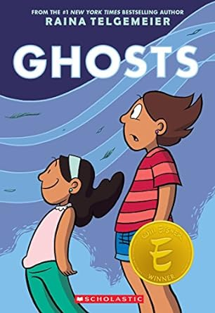

<!-- Page content -->

# Ghosts
### March 1, 2024

 
<!--
https://www.amazon.com/Very-Large-Expanse-Sea/dp/0062866567
-->

Ghosts follows Catrina’s move with her family from sunny southern California to the windy, coastal town of Bahía de la Luna in northern California. Cat is not pleased with the change of scenery, leaving behind her old life and friends. Her family had to move, though, because Cat’s sister, Maya, has cystic fibrosis. While living by the ocean may temporarily relieve Maya’s symptoms, there is no known cure for her disease. Maya makes peace with this reality by talking to the ghosts that inhabit Bahía de la Luna, but Cat is much more fearful and apprehensive. As Día de los Muertos approaches, Cat must face her feelings and embrace the phantoms. 

I wish I had a book like Ghosts around when I was younger. I dealt with (what felt like) an abnormal amount of death as a kid. Both Cat and Maya’s feelings towards life and death resonated with me deeply. I’m excited to read more books by Raina Telgemeier. I loved the distinct art style and use of color. As a big sister myself, I’m also a sucker for a good sister story. I’d totally recommend this book to anyone looking for an emotional, compelling read, especially during the spooky season! 

<iframe width="560" height="315" src="https://www.youtube.com/embed/UXQ8NAMoU5Q?si=O_bMWK9OObzAWw8_" title="YouTube video player" frameborder="0" allow="accelerometer; autoplay; clipboard-write; encrypted-media; gyroscope; picture-in-picture; web-share" allowfullscreen></iframe>

https://www.npr.org/2016/09/11/493183503/ghosts-takes-on-a-tough-topic-for-children

Telgemeier, R. (2016). Ghosts. Scholastic/Graphix.

Awards: Eisner Award for Best Publication for Kids (ages 9–12) and the Dwayne McDuffie Award for Kids' Comics

Tags: 

