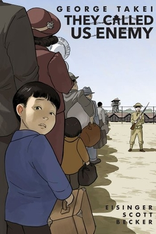

  <a href="dragon_ball.html"> <h2><em> Dragon Ball </em> by Akira Toriyama [Manga] </h2> </a>
    <h5>March 12, 2024</h5>

 

  
  

  

  

  Here is a preview of the post! 
     
  Tags: <a href="tags-graphic_novel.html">graphic novel</a> 
  

  

  <a href="clap_when_you_land.html"> <h2><em> Clap When You Land </em> by Elizabeth Acevedo [Novel] </h2> </a>
    <h5>March 11, 2024</h5>

 

  
  

  

  

  Here is a preview of the post! 
     
  Tags: <a href="tags-book.html">book</a> 
  

  

  <a href="six_of_crows.html"> <h2><em> Six of Crows </em> by Leigh Bardugo [Novel] </h2> </a>
    <h5>March 1, 2024</h5>

 

  
  

  

  

  Six of Crows is a fantasy dystopia novel set in the fictional city of Ketterdam. To prevent a dangerous drug from being released, Kaz must assemble a crew to break into the military Ice Court where a scientist is being held prisoner.
     
  Tags: <a href="tags-book.html">book</a> 
  

  

  <a href="ghosts.html"> <h2><em> Ghosts </em> by Raina Telgemeier [Graphic Novel] </h2> </a>
    <h5>February 29, 2024</h5>

 

  
  

  

  

  Ghosts follows Catrina’s move with her family from sunny southern California to the windy, coastal town of Bahía de la Luna in northern California. Cat is not pleased with the change of scenery, leaving behind her old life and friends. Her family had to move, though, because Cat’s sister, Maya, has cystic fibrosis.
     
  Tags: <a href="tags-graphic_novel.html">graphic novel</a>, <a href="tags-coming_of_age.html">coming of age</a> 
  

  

  <a href="pokemon_go.html"> <h2><em> Pokémon Go </em> [Video Game] </h2> </a>
    <h5>February 21, 2024</h5>

 

  
  

  

  

  Can you catch 'em all?
     
  Tags: <a href="tags-other_media.html">other media</a> 
  

  

  <a href="the_hate_u_give.html"> <h2><em> The Hate U Give </em> by Angie Thomas [Novel] </h2> </a>
    <h5>February 17, 2024</h5>

 

  
  

  

  

  Starr’s life has always been complicated: split between the cultures of her home neighborhood, Garden Heights, and the school she attends, Williamson Prep. When she experiences first-hand the trauma of best friend’s murder at the hands of the police, her life changes forever.
     
  Tags: <a href="tags-book.html">book</a> 
  

  

  <a href="the_absolutely_true_diary_of_a_part_time_indian.html"> <h2><em> The Absolutely True Diary of a Part-time Indian </em> by Sherman Alexie [Novel] </h2> </a>
    <h5>February 17, 2024</h5>

 

  
  

  

  

  The Absolutely True Diary of a Part-Time Indian follows Junior who, like generations before him, was born and raised on the Spokane Indian Reservation. Over time, Junior begins to want something different for his life.
     
  Tags: <a href="tags-book.html">book</a>, <a href="tags-coming_of_age.html">coming of age</a>  
  

  

  <a href="mondays_not_coming.html"> <h2><em> Monday's Not Coming </em> by Tiffany D. Jackson [Novel] </h2> </a>
    <h5>February 3, 2024</h5>

 

  
  

  

  

  Here is a preview of the post! 
     
  Tags: <a href="tags-book.html">book</a> 
  

  

  <a href="renee_rapp.html"> <h2><em> Snow Angel </em> by Reneé Rapp [Music Album] </h2> </a>
    <h5>February 1, 2024</h5>

 

  
  

  

  

  Here is a preview of the post! 
     
  Tags: <a href="tags-other_media.html">other media</a> 
  

  

  <a href="hello_goodbye_and_everything_in_between.html"> <h2><em> Hello, Goodbye, and Everything in Between </em> [Movie] </h2> </a>
    <h5>January 25, 2024</h5>

 

  
  

  

  

  Claire is leaving for Dartmouth College in the morning so she scheduled her breakup with Aidan tonight. Don’t worry, they’ve been planning this breakup ever since they got together last summer.
     
  Tags: <a href="tags-other_media.html">other media</a> 
  

  

  <a href="they_called_us_enemy.html"> <h2><em> They Called Us Enemy </em> by George Takei [Graphic Novel] </h2> </a>
    <h5>January 24, 2024</h5>

 

  
  

  

  

  The Called Us Enemy details a profound period of George Takei’s life. Not when he starred on Star Trek, but when he and his family were imprisoned by the U.S. government during World War II.  
     
  Tags: <a href="tags-graphic_novel.html">graphic novel</a>, <a href="tags-coming_of_age.html">coming of age</a> 
  

  

  <a href="high_school_musical.html"> <h2><em> High School Musical: The Musical: The Series </em> [TV Show] </h2> </a>
    <h5>January 24, 2024</h5>

 

  
  

  

  

  The school where <em>High School Musical</em> was filmed has never staged a production of <em>High School Musical: The Musical</em>? Straight to jail.
     
  Tags: <a href="tags-other_media.html">other media</a> 
  

  

  <a href="a_very_large_expanse_of_sea.html"> <h2><em> A Very Large Expanse of Sea </em> by Tahereh Mafi [Novel] </h2> </a>
    <h5>January 20, 2024</h5>

 

  
  

  

  

  In <em> A Very Large Expanse of Sea </em>, Shirin is a headstrong, cool hijabi starting her sophomore year at a new high school. It is the year after 9/11 and for Shirin, who has dealt with bigotry all her life, routine verbal abuse from her peers is all too familiar.
     
  Tags: <a href="tags-book.html">book</a>, <a href="tags-coming_of_age.html">coming of age</a>  
  

  

  <a href="monster.html"> <h2><em> Monster </em> by Walter Dean Myers [Novel] </h2> </a>
    <h5>January 19, 2024</h5>

 

  
  

  

  

  <em> Monster </em> by Walter Dean Myers tells the story of Steve Harmon.  Steve is on trial for the murder a drugstore owner, who was killed in a robbery gone wrong in Harlem, New York City.
     
  Tags: <a href="tags-book.html">book</a>
  

  

