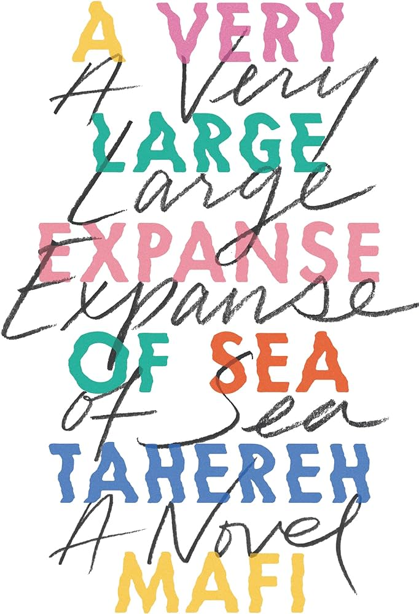

<!-- Page content -->

  <a href="ghosts.html"> <h2><em> Ghosts </em> by Leigh Bardugo [Graphic Novel] </h2> </a>
    <h5>February 29, 2024</h5>

 

  
  

  

  

  Ghosts follows Catrina’s move with her family from sunny southern California to the windy, coastal town of Bahía de la Luna in northern California. Cat is not pleased with the change of scenery, leaving behind her old life and friends. Her family had to move, though, because Cat’s sister, Maya, has cystic fibrosis.
     
  Tags: <a href="tags-graphic_novel.html">graphic novel</a>, <a href="tags-coming_of_age.html">coming of age</a> 
  

  

  <a href="the_absolutely_true_diary_of_a_part_time_indian.html"> <h2><em> The Absolutely True Diary of a Part-time Indian </em> by Sherman Alexie [Novel] </h2> </a>
    <h5>February 17, 2024</h5>

 

  
  

  

  

  The Absolutely True Diary of a Part-Time Indian follows Junior who, like generations before him, was born and raised on the Spokane Indian Reservation. Over time, Junior begins to want something different for his life.
     
  Tags: <a href="tags-book.html">book</a>, <a href="tags-coming_of_age.html">coming of age</a>  
  

  

  <a href="they_called_us_enemy.html"> <h2><em> They Called Us Enemy </em> by George Takei [Graphic Novel] </h2> </a>
    <h5>January 24, 2024</h5>

 

  
  

  

  

  The Called Us Enemy details a profound period of George Takei’s life. Not when he starred on Star Trek, but when he and his family were imprisoned by the U.S. government during World War II.  
     
  Tags: <a href="tags-graphic_novel.html">graphic novel</a>, <a href="tags-coming_of_age.html">coming of age</a> 
  

  

  <a href="a_very_large_expanse_of_sea.html"> <h2><em> A Very Large Expanse of Sea </em> by Tahereh Mafi [Novel] </h2> </a>
    <h5>January 20, 2024</h5>

 

  
  

  

  

  In <em> A Very Large Expanse of Sea </em>, Shirin is a headstrong, cool hijabi starting her sophomore year at a new high school. It is the year after 9/11 and for Shirin, who has dealt with bigotry all her life, routine verbal abuse from her peers is all too familiar.
     
  Tags: <a href="tags-book.html">book</a>, <a href="tags-coming_of_age.html">coming of age</a>  
  

  

