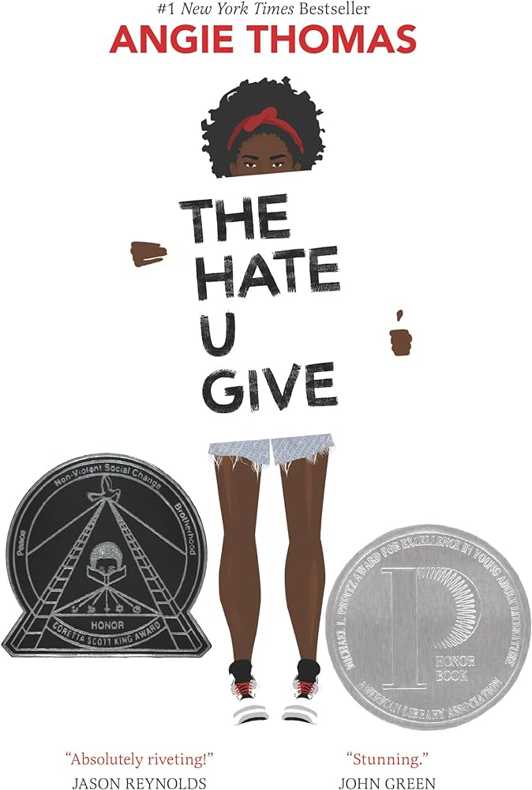

<!-- Page content -->

# <em> The Hate U Give </em> by Angie Thomas [Novel]
### February 17, 2024

<figure>

<figcaption> Source: </figcaption>
</figure>
Starr’s life has always been complicated: split between the cultures of her home neighborhood, Garden Heights, and the school she attends, Williamson Prep. When she experiences first-hand the trauma of best friend’s murder at the hands of the police, her life changes forever. Starr must confront everyday microaggressions in her life systemic racism. Above all, Starr must gain the confidence to use her voice to speak out for herself and what she believes is right. 

The Hate U Give is rightfully, widely praised. Angie Thomas an excellent writer, developing engaging characters and enthralling story, and also speaking to critical issues in our society today. This book provides a multidimensional, personal perspective to narratives that are often flattened in the media. I think this book should be required reading in classrooms everywhere. For Black teens, The Hate U Give provides a chance to feel seen and for everyone else, it provides a course on empathy. I am excited to dive into the rest of Thomas’ novels and watch The Hate U Give film adaptation. 

<iframe width="560" height="315" src="https://www.youtube.com/embed/3MM8OkVT0hw?si=8_IlWYnEwdSFLO33" title="YouTube video player" frameborder="0" allow="accelerometer; autoplay; clipboard-write; encrypted-media; gyroscope; picture-in-picture; web-share" allowfullscreen></iframe>

<iframe width="560" height="315" src="https://www.youtube.com/embed/CorQppCdxEI?si=_UnVEbM8V5EhR4P1" title="YouTube video player" frameborder="0" allow="accelerometer; autoplay; clipboard-write; encrypted-media; gyroscope; picture-in-picture; web-share" allowfullscreen></iframe>

**Awards:** Goodreads Choice Award, 2017, Winner, Young Adult Fiction
Books are My Bag Readers Awards, 2017, Winner, Young Adult
British Books Awards, 2018, Short List, Illustrated Children's Book
Carnegie Medal, 2018, Short List, Children's Book
Children's and Teen Choice Book Award, 2018, Finalist, Teen
Coretta Scott King Book Award, 2018, Honor, Author
Cybils Awards, 2017, Nominee, Young Adult Fiction
Edgar Allan Poe Awards, 2018, Nominee, Young Adult
German Youth Literature Award, 2018, Nominee, Prize of the Youth Jury
Boston Globe-Horn Book Award for Excellence in Children's Literature, 2017, Winner, Fiction
Indies Choice Book Award, 2018, Finalist, Young Adult Book
Kirkus Prize, 2017, Finalist, Young Reader
Los Angeles Times Book Prize, 2018, Finalist, Young Adult Literature
Michael L. Printz Award, 2018, Honor
National Book Award, 2017, Long List, Young People's Literature
Odyssey Award, 2018, Winner, Children (13-18)
Silver Inky, 2018, Long List
Waterstones Children's Book Prize, 2018, Winner, Older Fiction
William C. Morris Award, 2018, Winner, Young Adult

Tags: <a href="tags-book.html">book</a> 

Thomas, A. (2018). The hate u give. Walker Books.

