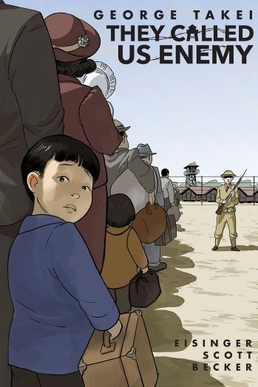

<!-- Page content -->

# They Called Us Enemy
### January 12, 2024

<!-- https://en.wikipedia.org/wiki/They_Called_Us_Enemy -->

The Called Us Enemy details a profound period of George Takei’s life. Not when he starred on Star Trek, but when he and his family were imprisoned by the U.S. government during World War II. Takei’s illustrated portrait of life in the Japanese internment camps is bittersweet: containing all of the best parts of growing up amidst a backdrop of tragic violations of human rights. Takei reminds us what it’s like to have a childlike reverence for our parents and naivety towards the world. This book is undoubtedly an important contribution to our history and culture, telling an authentically American story.

While I was reading this graphic novel, I kept thinking about what I had learned in history class about Japanese imprisonment during World War II. All I could picture in my head was a section within a chapter devoted to the topic. So many important historical events are relegated to brief mentions within our curriculum. They Called Us Enemy challenges us who were not impacted by Japanese imprisonment to educate ourselves on this event in American history. I’d recommend this book to anyone who likes compelling, human stories. If you’re not prepared to smile, tear up, and call your family at least once, this book might not be for you.

<iframe width="560" height="315" src="https://www.youtube.com/embed/ZQP23uqxQoA?si=hEvLgTPZdmg_FbH-" title="YouTube video player" frameborder="0" allow="accelerometer; autoplay; clipboard-write; encrypted-media; gyroscope; picture-in-picture; web-share" allowfullscreen></iframe>

<iframe width="560" height="315" src="https://www.youtube.com/embed/LeBKBFAPwNc?si=kxDHQbliDAQUSPrD" title="YouTube video player" frameborder="0" allow="accelerometer; autoplay; clipboard-write; encrypted-media; gyroscope; picture-in-picture; web-share" allowfullscreen></iframe>

Awards: VLA Graphic Novel Diversity Award for Youth	American Book Award, Asian/Pacific American Award for Literature for Young Adult Literature, Eisner Award for Best Reality-Based Work

Takei, G., Eisinger, J., & Scott, S. R. (2019). They Called Us Enemy. Top Shelf Productions.

Tags: 

